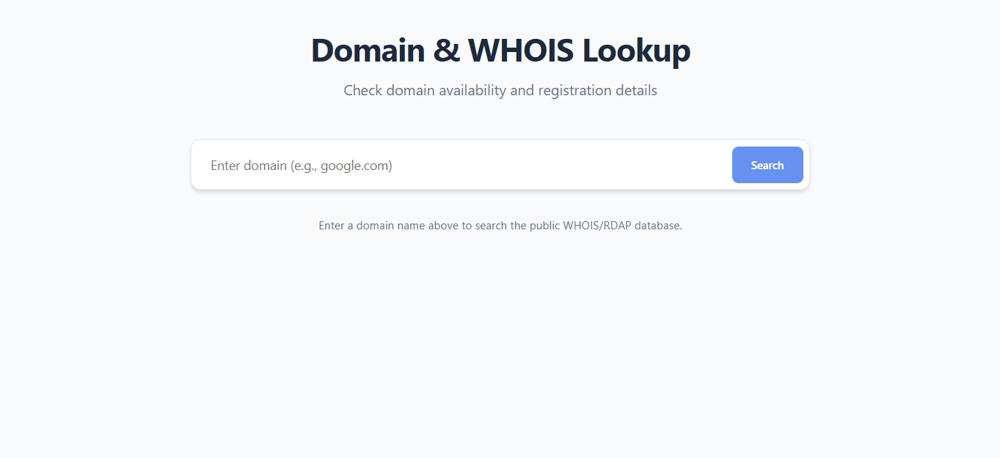

# 🌐 Domain & WHOIS (RDAP) Lookup Tool



A professional, high-performance web interface for checking domain availability and registration data using the modern **RDAP (Registration Data Access Protocol)**. Built with React, Vite, and TypeScript.

---

## ✨ Features

- **Real-Time Data**: Fetches live data from Verisign's RDAP servers (no cached or fake data).
- **Comprehensive Insights**: Displays registrar information, registration/expiration dates, name servers, and domain status codes.
- **Modern UI/UX**: Clean, minimalist search interface with smooth transitions and responsive design.
- **Availability Check**: Instantly identifies if a domain is available for registration (404 response handling).
- **Developer Friendly**: Built with a modular architecture and type-safe code.

---

## 🚀 Getting Started

To get this project running on your local machine, follow these simple steps.

### 📋 Prerequisites

Before you begin, ensure you have the following installed:
- **Node.js**: [Download and install Node.js](https://nodejs.org/) (Recommended version: v18 or higher).
- **npm**: Comes bundled with Node.js.

### 🛠️ Installation

1. **Clone the repository** (or download the source code).
2. **Navigate to the project directory**:
   ```powershell
   cd "c:/Users/Admin/Desktop/whois lookup/domain_checker"
   ```
3. **Install dependencies**:
   ```powershell
   npm install
   ```

### 💻 Running the Application

To start the development server:
```powershell
npm run dev
```
The application will be available at `http://localhost:5173`.

---

## 🛠️ Tech Stack

- **Framework**: [React 19](https://react.dev/)
- **Build Tool**: [Vite](https://vitejs.dev/)
- **Language**: [TypeScript](https://www.typescriptlang.org/)
- **Logic**: Custom Hooks & RDAP Parser
- **Styling**: Vanilla CSS (Modern CSS Variables & Flexbox/Grid)

---

## 📂 Project Structure

```text
domain_checker/
├── public/              # Static assets (images, icons)
├── src/
│   ├── components/      # UI Components (SearchBar, ResultCard, etc.)
│   ├── hooks/           # Custom React hooks (useRDAPLookup)
│   ├── utils/           # Helper functions (rdapParser)
│   ├── App.tsx          # Main Application component
│   ├── App.css          # Application layout styles
│   ├── index.css        # Global styles & design tokens
│   └── main.tsx         # Entry point
├── index.html           # HTML template
├── package.json         # Dependencies & scripts
└── tsconfig.json        # TypeScript configuration
```

---

## 🔍 How it Works

This tool utilizes the **RDAP (Registration Data Access Protocol)**, which is the modern successor to the old WHOIS protocol. 

1. **User Input**: The user enters a `.com` domain (e.g., `google.com`).
2. **API Request**: The app sends a GET request to Verisign's RDAP endpoint: `https://rdap.verisign.com/com/v1/domain/{domain}`.
3. **Parsing**: Our custom `rdapParser.ts` processes the complex JSON object to extract meaningful fields like Registrar Name, Expiration Date, and Status.
4. **Display**: Results are rendered in an organized, beautiful card format.

---

## 💡 Why It's Useful & Free

### 🌟 Why use this?
- **Speed**: Direct API access means you get the fastest possible response.
- **Privacy**: No middleman is tracking your domain searches like some commercial registrars might.
- **Accuracy**: It pulls directly from the registry (Verisign), the source of truth for `.com` domains.

### 🆓 Why is it free?
- **Open Standards**: The RDAP protocol is an open standard provided for public use by registries.
- **No Backend Costs**: This is a client-side application; it leverages your browser to fetch the data directly, eliminating the need for expensive server hosting.

---

## ⚠️ Important Note (CORS)

Most RDAP APIs (including Verisign) do not enable **CORS (Cross-Origin Resource Sharing)** for browser-based requests. 
- **Local Dev**: You might see a "CORS Error" in some environments.
- **Production**: In a production environment, this application usually requires a small backend proxy or a browser extension to bypass CORS restrictions. The tool is designed to notify you gracefully if this occurs.

---

## � License

This project is licensed under the MIT License - see the [LICENSE](LICENSE) file for details.

---

<div align="center">

### 💖 Made with love for Educational Institutions 

**⭐ Star this repository if you find it helpful!**
** Developed by N.G Neel

[Report Bug](https://github.com/WORKTEST-ai/domain_checker/issues) · [Request Feature](https://github.com/WORKTEST-ai/domain_checker/issues) · [Documentation](./docs)

</div>

---

<div align="center">

© 2026 all right - *domain checker APP*. All rights reserved.

</div>
